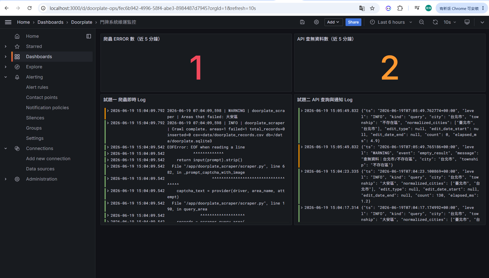
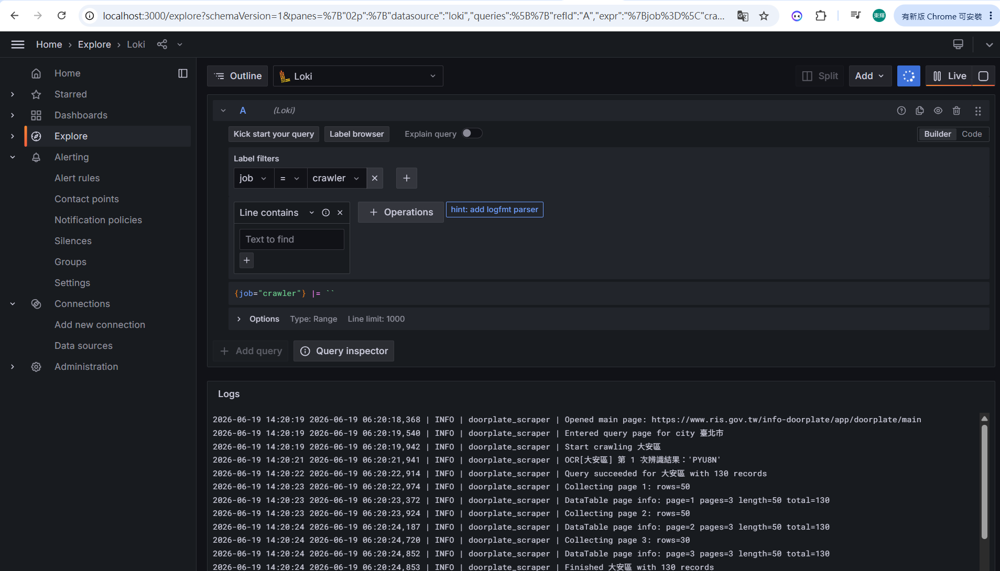
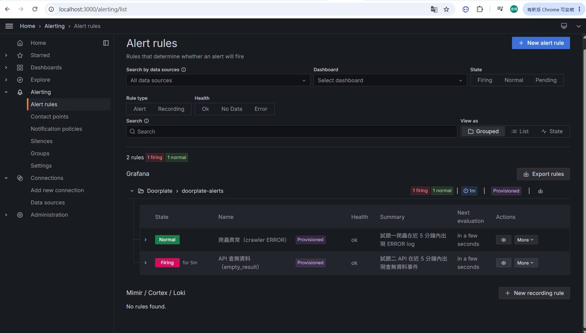
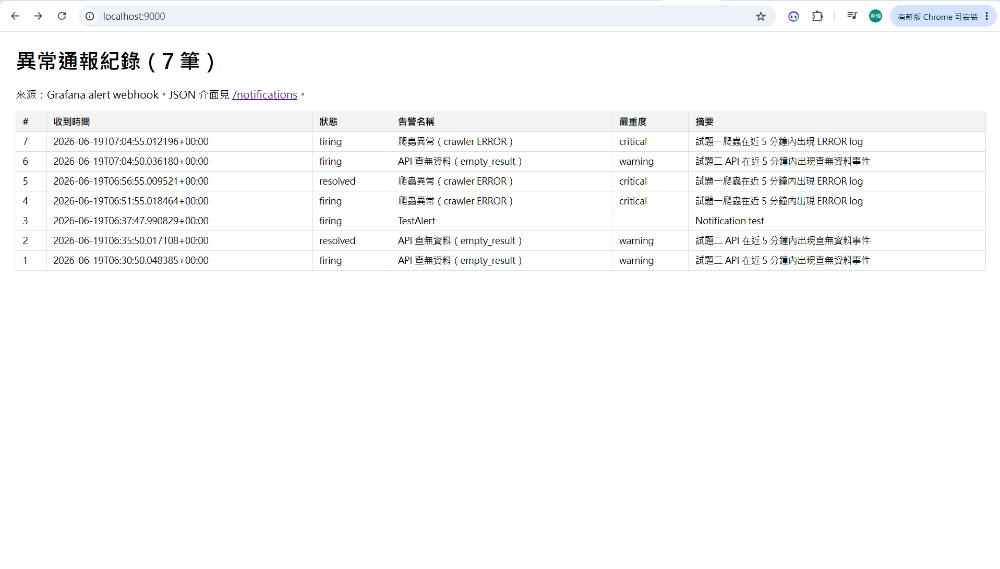

# 示範執行結果（交付物對照）

對應試題「請提供」清單，彙整各題的示範畫面與檔案證據。

| 請提供項目 | 證據 |
|------------|------|
| 1. 完整程式碼 | [試題一](../試題一/)、[試題二](../試題二/)、[試題三](../試題三/) |
| 2. 示範執行結果的 CSV | [試題一/data/verify/](../試題一/data/verify/)（c1～c5 共 5 組，另見試題一 README 抽查結果） |
| 3. 示範 API 執行結果 | 下方「試題二 API」 |
| 4. LOG 顯示查詢、通報紀錄 | 下方「試題三 Log 與通報」 |
| 5. 系統架構圖 | [試題四](../試題四/) |
| 6.排程設計 | [試題三 README — 自動化排程](../試題三/README.md) |

---

## 試題二 API 執行結果

### 查詢成功（台北市／大安區，count=130）
輸入 `{"city":"台北市","township":"大安區"}`，回傳 200 與 130 筆資料（台→臺 自動正規化）。

### 查無資料（count=0，觸發通報）
輸入不存在的區，回傳 200 + 空陣列；同時寫入 `empty_result` 事件，由平台偵測後通報。

---

## 試題三 Log 與通報

### 維運 Dashboard（即時 Log + 異常計數）
單一儀表板同時呈現：爬蟲 ERROR 數、API 查無資料數，以及試題一爬蟲、試題二 API 兩路即時 Log。

### 歷史 Log 查詢（Explore + LogQL）
以 LogQL（如 `{job="crawler"}`）查詢 Loki 中保留的歷史紀錄。

### 異常告警觸發（平台偵測）
Grafana 以 LogQL 計數異常事件，超門檻即 Firing：圖中「API 查無資料（empty_result）」為觸發中。

### 通報紀錄（notifier-sink）
Grafana 告警以 webhook 送至 notifier-sink 落地、可查詢。含爬蟲異常（critical）與 API 查無資料（warning）兩類，狀態涵蓋 firing／resolved。

