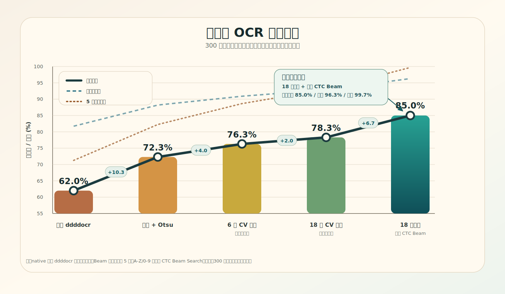
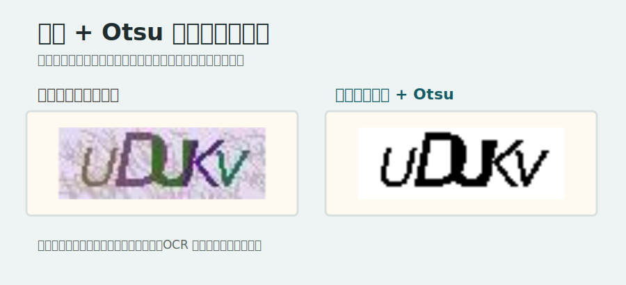
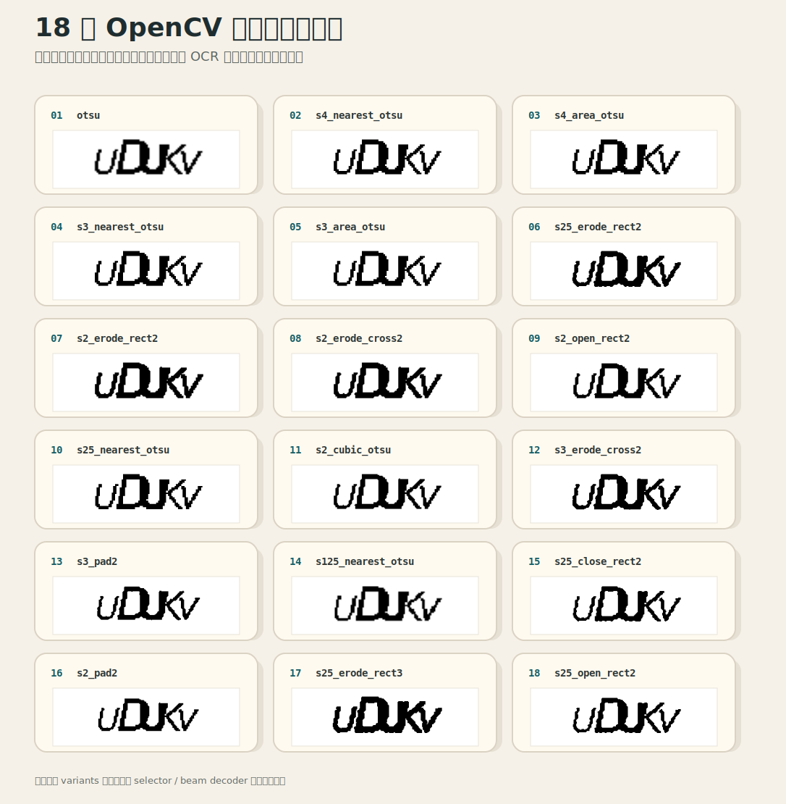
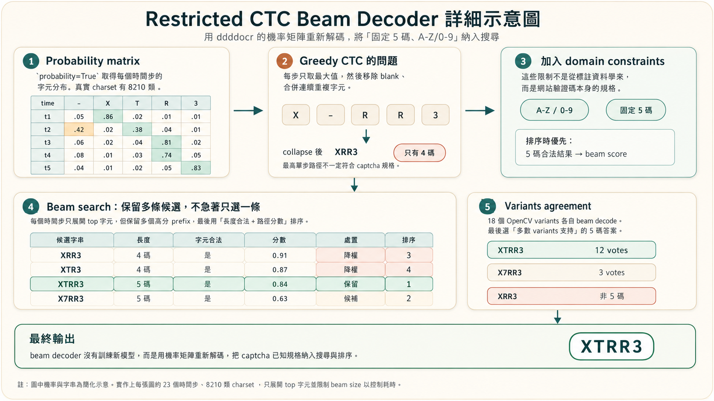

# 驗證碼 OCR 優化紀錄

本文記錄 `試題一` 驗證碼自動辨識從未優化 baseline 到目前最佳方案的完整實驗過程，正式爬蟲可以穩定使用。最佳方案重試三次即可達到理論 99% 成功率



## 目標

本站驗證碼固定為 5 碼，字元範圍可視為 `A-Z / 0-9`。最初目標是用 `ddddocr` 自動辨識，減少人工輸入；後續目標則是提高單次辨識成功率，並保留原本功能與速度選項。

正式流程保留三個層級：

| 模式 | 用途 |
|------|------|
| `--captcha-variants 1 --captcha-decoder native` | 預設行為，保留原本單一 Otsu OCR 路徑 |
| `--captcha-variants 6 --captcha-decoder native` | 平衡速度與準確率 |
| `--captcha-variants 18 --captcha-decoder beam` | 目前最高準確率模式 |

## 評測資料

為了避免只對單一樣本集調參，使用四組人工標註資料：

| 資料集 | 數量 | 用途 |
|--------|-----:|------|
| `data/captcha_samples` | 100 | 初期探索與比較 |
| `data/captcha_holdout_100` | 100 | 第一批 holdout |
| `data/captcha_holdout_extra_100` | 100 | 第二批 holdout |
| `data/captcha_holdout_extra2_100` | 100 | 第三批 holdout，用來驗證剪枝是否泛化 |

主要判斷以三批 holdout 合併 300 張為準。評估指標：

| 指標 | 意義 |
|------|------|
| `exact` | 整串 5 碼完全正確 |
| `char` | 字元級正確率 |
| `len5` | OCR 輸出剛好 5 碼的比例 |

## 階段 1：直接丟原圖給 ddddocr

直接把原始驗證碼圖片交給 `ddddocr`。

結果不理想，因為背景雜訊、字型變形與干擾線會讓 OCR 少字或誤判。

| 方案 | 原 100 exact | holdout #1 | holdout #2 | holdout #3 | 合併 300 exact |
|------|-------------:|-----------:|-----------:|-----------:|---------------:|
| 原圖直接辨識 | 59% | 62% | 58% | 66% | 62.0% |

結論：原圖直接辨識只能當 baseline，不足以穩定自動化。

## 階段 2：灰階 + Otsu 二值化



接著加入前處理：

1. 轉灰階。
2. 使用 Otsu threshold 做二值化。
3. 再交給 `ddddocr`。

這是第一個明顯有效的優化，原因是本站驗證碼的背景雜訊被二值化後會下降，字元輪廓也更明確。

| 方案 | 原 100 exact | holdout #1 | holdout #2 | holdout #3 | 合併 300 exact |
|------|-------------:|-----------:|-----------:|-----------:|---------------:|
| 原圖直接辨識 | 59% | 62% | 58% | 66% | 62.0% |
| 灰階 + Otsu | 71% | 69% | 72% | 76% | 72.3% |

結論：Otsu 是很穩的基本前處理，因此保留為預設 OCR 路徑。

## 階段 3：多 OpenCV variants



單一 Otsu 對部分圖片有效，但不同 captcha 對縮放、插值、形態學處理的敏感度不同。因此做了多種前處理 variants，對同一張 captcha 產生多個版本，再讓 OCR 分別辨識。

目前 18 種 variants：

| 順序 | variant | 做法 |
|----:|---------|------|
| 1 | `otsu` | 原尺寸灰階 + Otsu |
| 2 | `s4_nearest_otsu` | 放大 4 倍 nearest + Otsu |
| 3 | `s4_area_otsu` | 放大 4 倍 area + Otsu |
| 4 | `s3_nearest_otsu` | 放大 3 倍 nearest + Otsu |
| 5 | `s3_area_otsu` | 放大 3 倍 area + Otsu |
| 6 | `s25_erode_rect2` | 放大 2.5 倍 cubic + Otsu + 2x2 rect erode |
| 7 | `s2_erode_rect2` | 放大 2 倍 cubic + Otsu + 2x2 rect erode |
| 8 | `s2_erode_cross2` | 放大 2 倍 cubic + Otsu + 2x2 cross erode |
| 9 | `s2_open_rect2` | 放大 2 倍 cubic + Otsu + 2x2 rect opening |
| 10 | `s25_nearest_otsu` | 放大 2.5 倍 nearest + Otsu |
| 11 | `s2_cubic_otsu` | 放大 2 倍 cubic + Otsu |
| 12 | `s3_erode_cross2` | 放大 3 倍 cubic + Otsu + 2x2 cross erode |
| 13 | `s3_pad2` | 放大 3 倍 cubic + Otsu + 四周補 2px 白邊 |
| 14 | `s125_nearest_otsu` | 放大 1.25 倍 nearest + Otsu |
| 15 | `s25_close_rect2` | 放大 2.5 倍 cubic + Otsu + 2x2 rect closing |
| 16 | `s2_pad2` | 放大 2 倍 cubic + Otsu + 四周補 2px 白邊 |
| 17 | `s25_erode_rect3` | 放大 2.5 倍 cubic + Otsu + 3x3 rect erode |
| 18 | `s25_open_rect2` | 放大 2.5 倍 cubic + Otsu + 2x2 rect opening |

native selector 的規則：

1. 每個 variant 呼叫 `classification(..., probability=True)`。
2. 優先選輸出長度為 5 的候選。
3. 在長度符合者中選 `confidence` 最高者。

| 方案 | 原 100 exact | holdout #1 | holdout #2 | holdout #3 | 合併 300 exact |
|------|-------------:|-----------:|-----------:|-----------:|---------------:|
| 灰階 + Otsu | 71% | 69% | 72% | 76% | 72.3% |
| `--captcha-variants 6` | 78% | 76% | 75% | 78% | 76.3% |
| `--captcha-variants 18` | 80% | 76% | 81% | 78% | 78.3% |

結論：多 variants 明確有效，但只靠 ddddocr native greedy decode 仍有少字問題。

## 階段 5：restricted CTC beam decoder



改用 `probability=True` 的完整機率矩陣，自行做 CTC beam search。

做法：

1. 每個 variant 仍先產生前處理圖。
2. 呼叫 `ddddocr.classification(processed, probability=True)`。
3. 取出每個時間步的 probability matrix。
4. 自行做 CTC beam search。
5. 字元限制為 `A-Z / 0-9`。
6. 優先選 5 碼結果。
7. 18 個 variants 各自 beam decode 後，再用 text agreement 選最終答案。

這能修掉許多 greedy decode 的少字問題。例如 greedy 可能輸出 `XRR3`，beam search 會保留更多候選路徑，找回較合理的 `XTRR3`。

| 方案 | 原 100 exact | holdout #1 | holdout #2 | holdout #3 | 合併 300 exact | 合併 char | 合併 len5 |
|------|-------------:|-----------:|-----------:|-----------:|---------------:|----------:|----------:|
| `--captcha-variants 18` native | 80% | 76% | 81% | 78% | 78.3% | 92.9% | 92.3% |
| `--captcha-variants 18 --captcha-decoder beam` | 85% | 82% | 88% | 85% | 85.0% | 96.3% | 99.7% |

結論：beam decoder 是目前最有效的提升，且三批 holdout 都維持高於 native。

## 目前最佳方案

最高準確率指令：

```powershell
python .\main.py --captcha auto --captcha-variants 18 --captcha-decoder beam --areas 大安區
```

三批 holdout 合併 300 張結果：

| 指標 | 結果 |
|------|-----:|
| exact | 255/300 = 85.0% |
| char | 96.3% |
| len5 | 99.7% |
| 評測耗時 | 約 305ms/張 |

速度與準確率的取捨：

| 模式 | 合併 300 exact | 特性 |
|------|---------------:|------|
| Otsu native | 72.3% | 最快，預設單 variant 路徑 |
| 6 variants native | 76.3% | 速度與準確率平衡 |
| 18 variants native | 78.3% | native decoder 的完整 variants |
| 18 variants beam | 85.0% | 目前最高準確率 |

## 重試成功率估算

正式爬蟲有 5 碼閘門與重試機制。若單次成功率為 `p`，重試 `n` 次的累積成功率為：

```text
1 - (1 - p)^n
```

以合併 300 張 holdout 的單次 exact 估算，1 到 6 次累積成功率如下：

| 嘗試次數 | Otsu native `72.3%` | 6 variants native `76.3%` | 18 variants beam `85.0%` |
|---------:|--------------------:|---------------------------:|-------------------------:|
| 1 | 72.30% | 76.30% | 85.00% |
| 2 | 92.33% | 94.38% | 97.75% |
| 3 | 97.87% | 98.67% | 99.66% |
| 4 | 99.41% | 99.68% | 99.949% |
| 5 | 99.84% | 99.925% | 99.992% |
| 6 | 99.955% | 99.982% | 99.999% |

因此即使單次不是 100%，搭配換圖重試後，實務上成功率已很高；若仍失敗，流程會自動降級人工輸入。

## 相關腳本

| 腳本 | 用途 |
|------|------|
| `scripts/collect_captchas.py` | 蒐集 captcha 圖片 |
| `scripts/label_captchas.py` | 產生人工標註頁並匯出 `labels.csv` |
| `scripts/eval_captcha.py` | ddddocr 原始預測報告 |
| `scripts/eval_cv.py` | 比較 OpenCV 前處理 |
| `scripts/eval_variant_selector.py` | 比較 variants selector 策略 |
| `scripts/eval_beam_ablation.py` | beam variants 剪枝 / leave-one-out 實驗 |

## 最終判斷

目前最可靠的正式方案是：

```text
18 variants + restricted CTC beam decoder + agreement selector
```

不採用的方案：

| 方案 | 不採用原因 |
|------|------------|
| 原圖直接辨識 | 準確率太低 |
| 單純 confidence selector | 容易選到高信心但少字的錯誤結果 |

目前 overfit 風險相對低，因為最佳方案不是從 labels 學出特定規則，而是利用 captcha 固定規格：5 碼、`A-Z/0-9`、CTC beam search。三批獨立 holdout 都維持 82% 以上，合併 300 張為 85.0%。後續若網站更換 captcha 字型或干擾方式，建議再蒐集新 holdout 重跑同一套評測。
