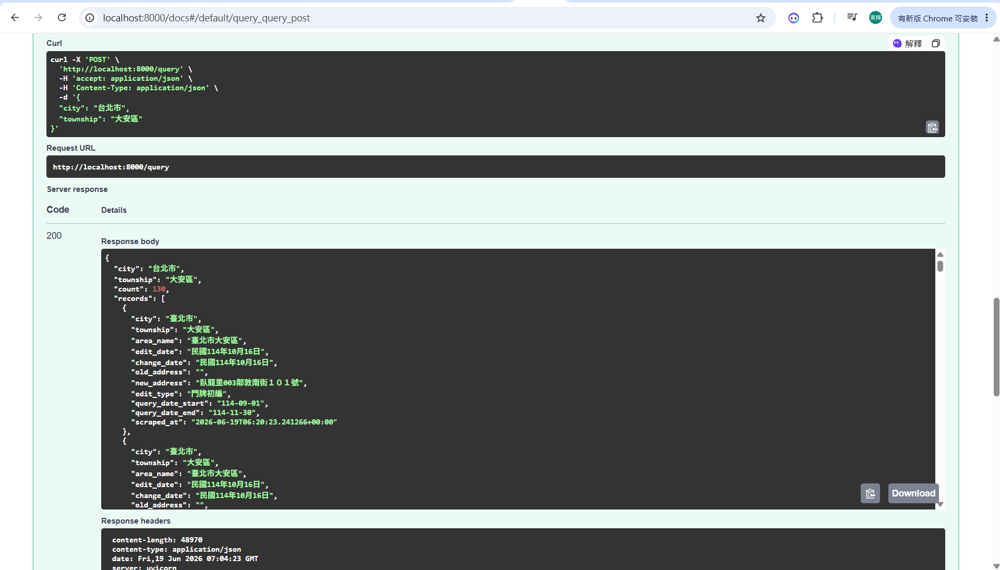
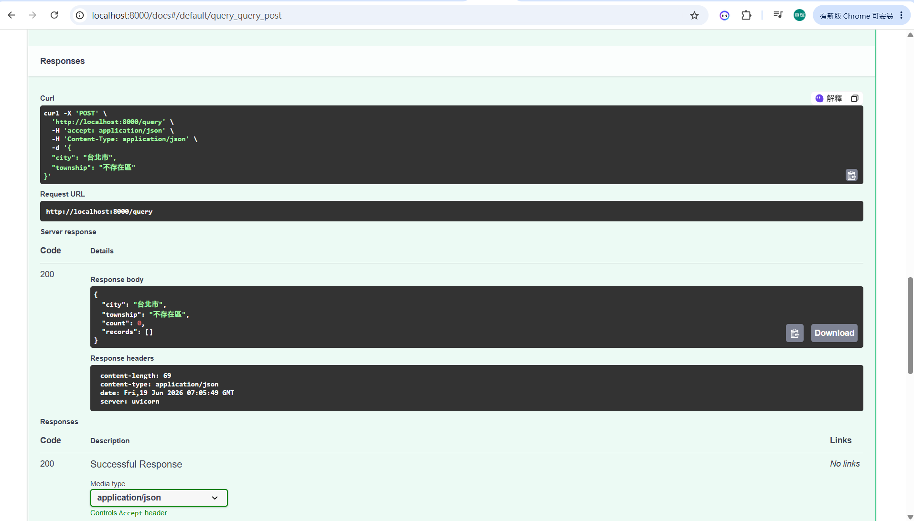

# 試題二：門牌資料查詢 API

以 **FastAPI** 開發的查詢服務，輸入縣市、鄉鎮市區，回傳[試題一](../試題一/)爬蟲落地於 SQLite 的門牌異動資料。

## 前置需求

- **Python 3.10+**
- **試題一已產生的 SQLite 資料庫**（本服務唯讀查詢，不自行爬取）。
  - 預設讀取 `../試題一/data/doorplate.sqlite3`；可用環境變數 `DB_PATH` 指向其他 DB。

## 安裝

```powershell
pip install -r .\試題二\requirements.txt
```

## 環境變數

| 變數 | 說明 | 預設 |
|------|------|------|
| `DB_PATH` | 要查詢的 SQLite 路徑（試題一落地的 DB） | `../試題一/data/doorplate.sqlite3` |
| `LOG_DIR` | 日誌輸出目錄 | `試題二/logs` |

> 容器化時把試題一的 DB、本服務的 log 各掛成共用 volume，即可與試題一、試題三建立關聯。

## 啟動

```powershell
cd .\試題二
# 指定要查詢的 DB（範例用試題一的某個輸出）
$env:DB_PATH = "..\試題一\data\doorplate.sqlite3"
uvicorn app.main:app --host 0.0.0.0 --port 8000
```

啟動後開 <http://localhost:8000/docs> 即為 FastAPI 自動產生的互動式 API 文件（可直接試打、當作示範畫面）。

## 端點

### `POST /query`

輸入縣市、鄉鎮市區，回傳資料。

```powershell
curl -X POST http://localhost:8000/query `
  -H "Content-Type: application/json" `
  -d '{"city":"台北市","township":"大安區"}'
```

**輸入欄位**：

| 欄位 | 必填 | 說明 |
|------|------|------|
| `city` | ✅ | 縣市，例如 `台北市`（台↔臺 自動正規化） |
| `township` | ✅ | 鄉鎮市區，例如 `大安區` |
| `edit_type` | 選用 | 編訂類別，精確比對（例如 `門牌初編`） |
| `edit_date_start` | 選用 | 編訂日期起（民國，含當日，例如 `114/10/01`） |
| `edit_date_end` | 選用 | 編訂日期迄（民國，含當日，例如 `114/10/31`） |

> `city` / `township` 為題目要求的條件；其餘為**選用過濾**（對應試題一的爬蟲參數、DB 已存欄位），未提供則不過濾。編訂日期同時相容 DB 內「民國114年10月16日」與輸入「114/10/01」等寫法。

回傳：

```json
{
  "city": "台北市",
  "township": "大安區",
  "count": 130,
  "records": [
    {
      "city": "臺北市",
      "township": "大安區",
      "area_name": "臺北市大安區",
      "edit_date": "民國114年10月16日",
      "change_date": "民國114年10月16日",
      "old_address": "",
      "new_address": "臥龍里003鄰敦南街１０１號",
      "edit_type": "門牌初編",
      "query_date_start": "114-09-01",
      "query_date_end": "114-11-30",
      "scraped_at": "..."
    }
  ]
}
```

- **縣市正規化**：題目輸入為「**台**北市」，試題一 DB 多存「**臺**北市」；查詢時兩種寫法都比對，避免因「台/臺」差異而查無資料。
- **查無資料**：回 `200` + `count: 0`（空陣列），並**發出異常通知**（見下節）。空結果是要被通報的正常情境，故非 `404`。

### `GET /health`

健檢端點（容器 healthcheck / 系統自動健檢用）：回傳 DB 是否可用與資料筆數。

```json
{ "status": "ok", "db_path": "...", "db_available": true, "records": 130, "detail": "" }
```

DB 不存在或尚未爬取時 `status` 為 `degraded`，且 `POST /query` 會回 `503` 並提示先執行試題一。

### `GET /docs`

FastAPI 自動產生的 Swagger UI。

## 示範執行結果

查詢成功（台北市／大安區，count=130）：



查無資料（count=0，會觸發試題三通報）：



## 日誌與異常通知（銜接試題三）

所有日誌同時寫入 `LOG_DIR`（**JSON 每行一筆**，方便試題三的 Log 收集器解析）與 stdout（容器 log driver 收集）：

| 檔案 | 內容 |
|------|------|
| `query.log` | 每次查詢：縣市、鄉鎮市區、正規化後比對的縣市、結果筆數、耗時 |
| `notify.log` | 異常通知：查無資料（`empty_result`）、DB 不可用（`db_unavailable`） |
| `app.log` | 服務啟動等一般訊息 |

通知目前為最小實作（寫入 `notify.log` + stdout 告警）。介面 `Notifier.notify(event, message, **context)` 設計為可插拔，**試題三可替換為實際通知管道（webhook / Slack / email…）而不需改動 API 邏輯**。

## 測試

```powershell
cd .\試題二
python -m pytest
```

涵蓋：查詢命中、台↔臺 正規化、空結果回 200、輸入驗證（空字串 422）、健檢。

## 技術選型

- **FastAPI + uvicorn**：非同步、內建 Pydantic 輸入驗證與自動 OpenAPI/Swagger 文件，適合作為查詢服務並提供可直接示範的 API 畫面。
- **aiosqlite 唯讀查詢**：與試題一相同的存取方式；API 僅 `SELECT`，不寫入資料。
- **以 `DB_PATH` 解耦**：API 不綁死資料來源路徑，方便本機執行與容器化掛載共用 volume。
