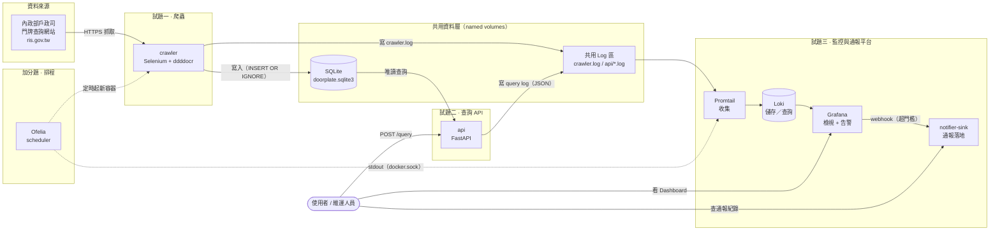
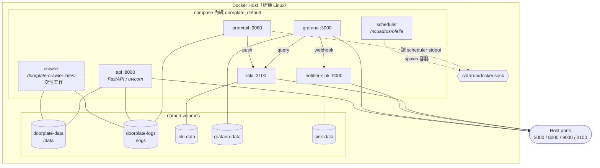
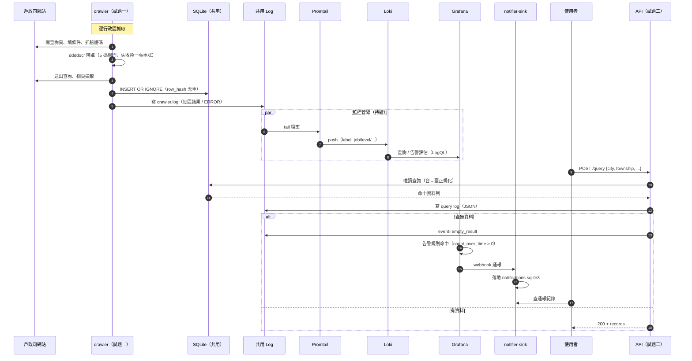
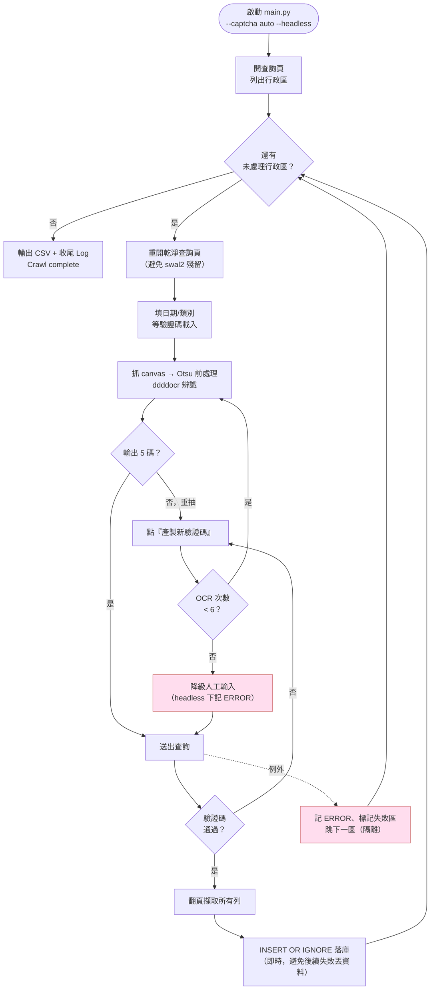
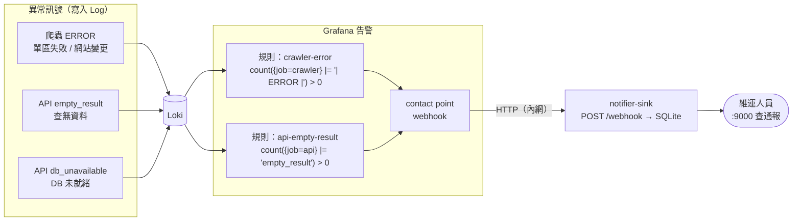
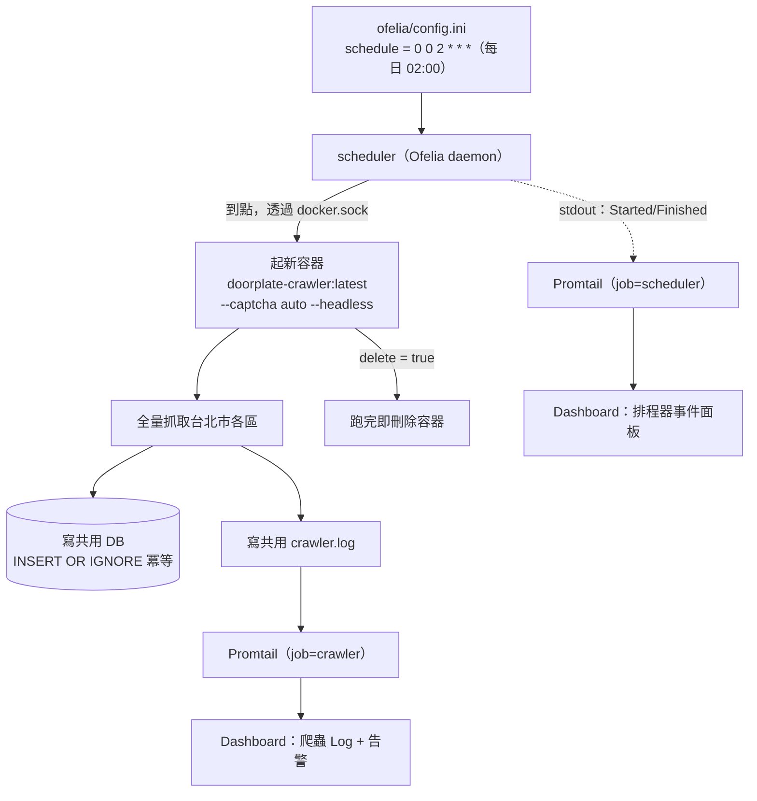
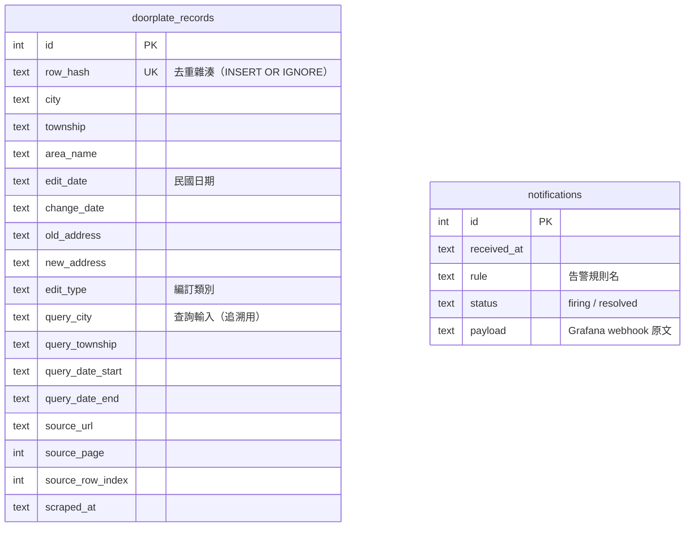

# 試題四：系統架構圖

本文件以多個視角呈現整套系統，涵蓋試題一（爬蟲）、試題二（查詢 API）、
試題三（Log 收集與異常通報）與加分題（自動化排程）。
圖以 [Mermaid](https://mermaid.js.org/) 撰寫，GitLab／GitHub 可直接渲染。

- [1. 系統總覽](#1-系統總覽)
- [2. 容器部署架構（docker compose）](#2-容器部署架構docker-compose)
- [3. 端到端資料流](#3-端到端資料流)
- [4. 爬蟲內部流程（試題一）](#4-爬蟲內部流程試題一)
- [5. 異常通報流程（試題三）](#5-異常通報流程試題三)
- [6. 自動化排程（加分題）](#6-自動化排程加分題)
- [7. 資料模型](#7-資料模型)
- [8. 技術棧與元件對照](#8-技術棧與元件對照)
- [9. 設計取捨](#9-設計取捨)

---

## 1. 系統總覽

四個子系統圍繞「一份共用 SQLite 資料 + 一份共用 Log」協作：爬蟲產資料、API 供查詢、
監控平台收集 Log 並在異常時通報，排程器則定期觸發爬蟲形成維運閉環。

---

## 2. 容器部署架構（docker compose）

全部服務以單一 `docker compose`（專案名 `doorplate`）編排。容器間僅透過
**named volumes（共用資料）** 與 **Compose 內網（HTTP）** 耦合，無直接程式相依。

**耦合方式**

| 關係 | 機制 | 說明 |
|------|------|------|
| crawler → api | 共用 `doorplate-data` volume 上的 SQLite | API 唯讀，不寫 DB |
| crawler / api → promtail | 共用 `doorplate-logs` volume | Promtail tail 檔案 |
| scheduler → crawler | 掛 `docker.sock`，依映像起新容器 | 無需宿主機 cron |
| promtail → scheduler | 掛 `docker.sock`，Docker 服務發現收 stdout | 排程事件可觀測 |
| grafana → sink | Compose 內網 HTTP webhook | 平台偵測異常 → 通報 |

---

## 3. 端到端資料流

從「網站原始資料」到「使用者查詢結果」與「異常通報」的完整時序。

---

## 4. 爬蟲內部流程（試題一）

爬蟲的關鍵在於**驗證碼自動辨識**與**單區失敗隔離**。

> 驗證碼重試次數取 6 的依據：單次成功率實測，預設 Otsu 約 0.72、最佳模式
> （`--captcha-variants 18 --captcha-decoder beam`）約 0.85。累積成功率 `1-(1-p)^n`：
> 以最佳模式 p=0.85，n=6 已達 ~99.999%（即便 Otsu 也達 ~99.95%），再往上邊際效益極小，
> 故用盡 6 次即降級人工。

---

## 5. 異常通報流程（試題三）

採「**平台偵測為主**」：不在應用程式內各自接通知，而是把所有狀態寫成 Log，
由 Grafana 統一以 LogQL 計數、超門檻才通報。新增偵測規則不需改動應用程式。

---

## 6. 自動化排程（加分題）

Ofelia 以 Docker 原生方式排程，無需宿主機 cron。排程結果同樣寫入共用 volume，
因此**排程跑的資料一樣進監控、失敗一樣告警**，與手動執行共用同一條維運鏈路。

> 若環境不允許掛 `docker.sock`，可改用 Host 排程：
> `0 2 * * * docker compose run --rm crawler ...`（cron / 工作排程器）。

---

## 7. 資料模型

爬蟲落地的核心表 `doorplate_records`（試題一寫、試題二讀）與通報表 `notifications`
（試題三 notifier-sink 寫）。

> 兩表分屬不同 volume／不同服務，無外鍵關係；`notifications` 由 Grafana 告警事件驅動，
> 與 `doorplate_records` 是「監控 vs 業務」兩條獨立資料流。

---

## 8. 技術棧與元件對照

| 子系統 | 元件 | 技術 | 對外埠 | 職責 |
|--------|------|------|--------|------|
| 試題一 | crawler | Python 3.12 · Selenium · Chromium · ddddocr · OpenCV | — | 抓門牌異動、驗證碼自動辨識、落 DB/CSV |
| 試題二 | api | FastAPI · uvicorn · aiosqlite | 8000 | 唯讀查詢 API（`POST /query`、`/health`、`/docs`） |
| 試題三 | promtail | Grafana Promtail | (9080) | 收集共用 Log + scheduler stdout |
| 試題三 | loki | Grafana Loki | 3100 | Log 儲存／查詢（保留 7 天） |
| 試題三 | grafana | Grafana | 3000 | Dashboard + LogQL 告警 |
| 試題三 | notifier-sink | FastAPI · SQLite | 9000 | 收 webhook、落地可查詢通報 |
| 加分題 | scheduler | mcuadros/ofelia | — | Docker 原生定時起 crawler |

**共用資源**：`doorplate-data`（SQLite）、`doorplate-logs`（Log）、`docker.sock`（排程 + 服務發現）。

---

## 9. 設計取捨

| 決策 | 選擇 | 理由 |
|------|------|------|
| API 存取爬蟲資料 | 共用 volume + 唯讀 SQLite | 零額外服務、職責清楚；API 不寫入避免與爬蟲競用 |
| 驗證碼 | ddddocr + Otsu + 5 碼閘門 + 自動重試/降級 | 兼顧自動化與穩定，失敗有人工後路 |
| 去重 | `row_hash` + `INSERT OR IGNORE` | 排程重跑冪等，不產生重複資料 |
| 異常偵測 | 平台偵測（Grafana LogQL）為主 | 應用只管寫 Log，新增規則免改程式、解耦 |
| 通報落地 | webhook → notifier-sink（SQLite） | 通報可查詢、可重放，便於 demo 與稽核 |
| 排程 | Ofelia（容器內） | 免宿主機 cron，結果同進監控形成閉環 |
| 多行 Log | Promtail multiline 合併 traceback | 避免 traceback 各行被打散排序而看似錯亂 |
